## RLHF中的PPO算法

#### 1. 策略梯度

PPO属于策略梯度的优化方法，策略梯度最大化奖励对轨迹的数学期望：
$$
\mathop{max}\limits_{\theta}P(\tau,\theta)R(\tau)
$$
用样本近似，假设状态$s_{i+1}$只与状态$s_i$和动作$a_i$有关，则一个轨迹的概率$P(\tau,\theta)$可以写作:
$$
P(\tau, \theta) = \prod\limits_{t=0}^{T}\pi(a_i|s_i,\theta)*P(s_{i+1}|s_i, a_i)
$$
代入到上面的期望中，可以得到：
$$
\mathop{max}\limits_{\theta}\prod_{t=0}^{T}\pi(a_i|s_i, \theta)*P(s_{i+1}|s_i, a_i)R(\tau)
$$
求梯度，去除掉与$\theta$无关的项，并利用对数公式$\nabla P = P*\nabla logP$，得到：
$$
\nabla J(\theta) = \mathop{E}_{\tau \sim \pi_{\theta}}\sum_{i=0}^{T}\nabla log(\pi(a_i|s_i,\theta))*R(\tau)
$$
可以按照时间步拆开累计奖励$R(\tau)$:
$$
\begin{align}
      \nabla J(\theta) &= \mathop{E}_{\tau \sim \pi_{\theta}}\sum_{i=0}^{T}\nabla log(\pi(a_i|s_i,\theta))*\sum\limits_{j=0}^{T}r_{j} 
\end{align}
$$
具体推导参考：[【强化学习】策略梯度算法梯度推导和损失函数 - 知乎 (zhihu.com)](https://zhuanlan.zhihu.com/p/563053450)

由于上面的$R(\tau)$对于一条轨迹$\tau$中的每个动作都是一样的，可以使用累计奖励优化成下面的reward-to-go的形式：
$$
\begin{align}
      \nabla J(\theta) &= \mathop{E}_{\tau \sim \pi_{\theta}}\sum_{i=0}^{T}\nabla log(\pi(a_i|s_i,\theta))*\sum\limits_{j=i}^{T}r_{j} 
\end{align}
$$
数学原理上不清楚为什么这样更好。

#### 2. Actor Critic

actor-critic是为了解决两个问题：基于值的算法(例如Q-learning)的高偏差(high bias)和基于策略梯度的算法(例如使用蒙特卡洛算法优化的策略梯度)的高方差(high varience)。关于这两个问题的解释可以参考[强化学习中值函数与优势函数的估计方法 - 知乎 (zhihu.com)](https://zhuanlan.zhihu.com/p/345687962)中的描述。简而言之，Actor critic不再估计一个动作的绝对价值奖励(例如上面提到的reward-to-go的绝对奖励)，而是相对与其他动作的优势：
$$
A^{\pi}(s,a) = Q^{\pi}(s, a) - V^{\pi}(s)
$$
参考PPO论文中对优势$A$的定义：

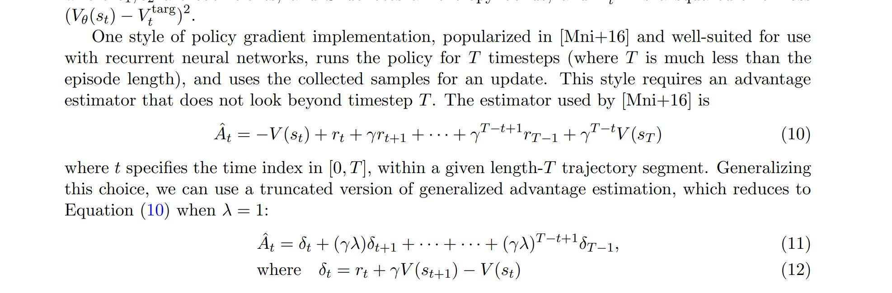

可以看出是使用了$T$个时间步的奖励和价值，$\delta_t$的定义和TD相同，有点像是考虑了未来很多步的TD，叫做General Advantage Estimation(GAE)。从上面可以得到下面的递推公式：
$$
\hat{A}_t = \delta_t + \gamma\lambda \hat{A}_{t+1}
$$
说明可以动态规划从后往前计算优势。

#### 3. PPO的优化

on-policy的要求：参数是$\theta$采样出来的策略只能用来更新参数是$\theta$的网络，不然优势估计、动作输出就会和反传的梯度对不上。off_policy则是什么参数采样出来的策略都能用来更新参数是$\theta$的网络。

PPO属于on-policy的策略，但是由于使用了比值$\frac{\pi_{k+1}}{\pi_k}$去进行重要性采样（这个重要性采样的思想来源于TRPO[Trust region policy optimization](https://proceedings.mlr.press/v37/schulman15.html)），因此也可以使用相差不大的策略采样得到的数据去更新现有策略，也不是完全的on-policy。PPO主要针对这个“相差不大”做了两种优化：

一种是KL散度的优化，是在TRPO的基础上引入了一个自适应的倍数$\beta$：

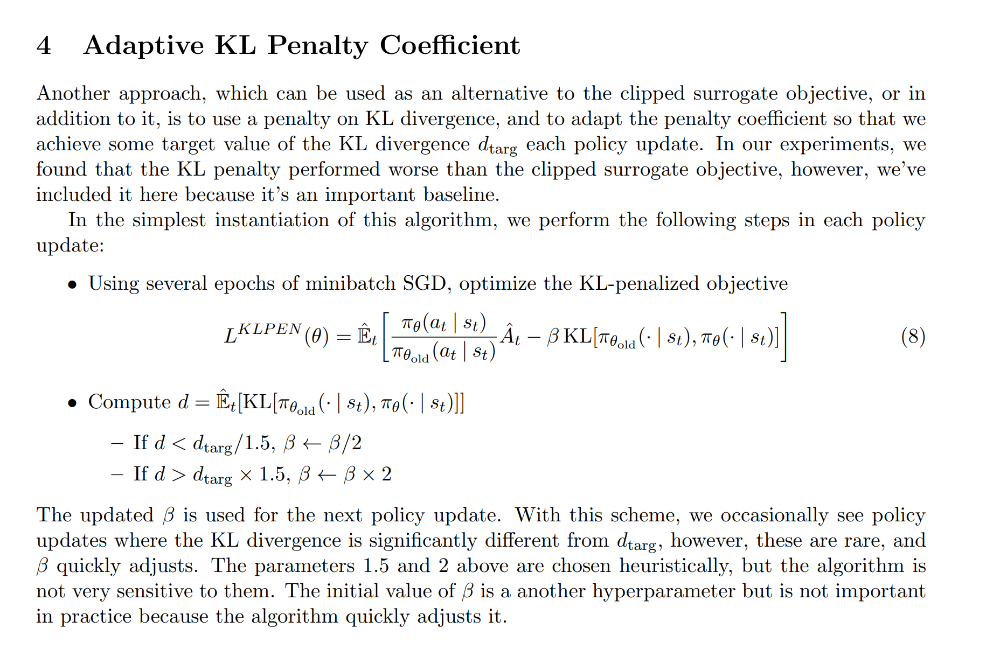

更新的幅度和偏离采样策略$\theta_{old}$的程度----即KL散度有关。

另外一种是较为常用的截断法：

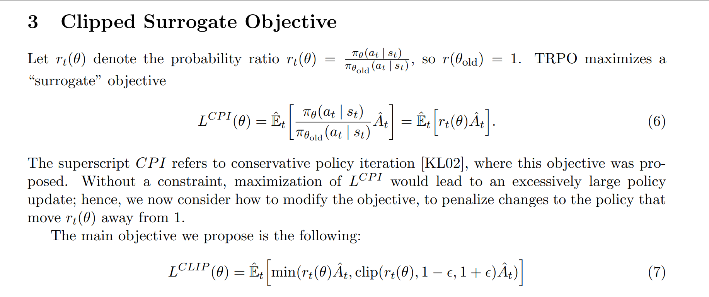

PPO最大化下面的损失函数为：

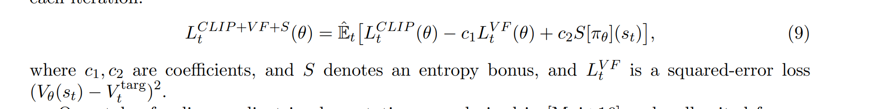

第一项更新Actor网络，第二项更新Critic网络，第三项是熵的奖励([信息熵 Entropy --- 不确定性的单位](https://www.jianshu.com/p/d235e2dba7a3))，鼓励模型的动作概率分布趋向平均。

#### 4. RLHF中的PPO

结合deepspeed中的RLHF代码为例，从原理到代码，讲解下怎么在训练LLM中应用PPO算法。

首先在理解怎么应用PPO之前需要对整个流程有一定的了解。RLHF的整个流程和论文InstructGPT的流程一样，分三步：监督微调(SFT)，奖励模型训练，强化学习训练。

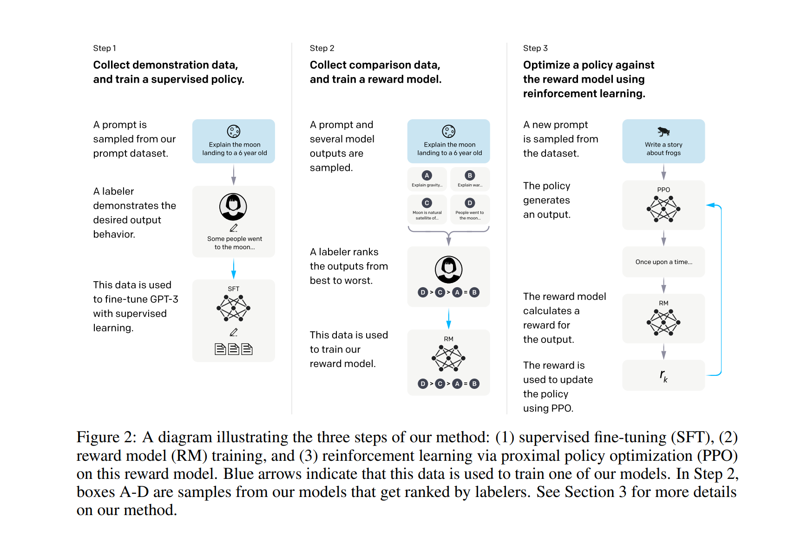

监督训练就是又用高质量的语料训练了一下模型，奖励模型训练可以理解成一个NLU的回归任务，输入是两段文本，从某个角度进行打分（例如LLama2里的帮助性偏好和安全性偏好）。在满足前两步之后就是怎么用PPO强化LM了。以一条样本为例，现在手头有一个奖励模型rm和一个初始语言模型(LM)，我们先复制两次初始的LM，叫做LM1和LM2。PPO需要一个Actor一个Critic，这里分别对应LM1和LM2。现在有4个模型参与训练，分别是奖励模型rm，参考模型ref，PPO的两个模型actor和critic。训练的流程如下：

```python
#输入：一个奖励模型rm，一个语言模型LM，一个prompt语料库
从LM初始化3个模型: actor, critic, ref。ref和rm不更新参数。
for i in train_epochs:
    采样prompt，用actor模型生成文本，奖励模型打分得到奖励。
	for j in ppo_epochs:
        用上面生成的文本计算优势，利用PPO算法更新actor和critic模型。
```


下面参考deepspeed的代码(https://github.com/microsoft/DeepSpeedExamples/tree/master/applications/DeepSpeed-Ch)进行理解：

**初始化：**上面的4个模型在`rlhf_engine`中定义：

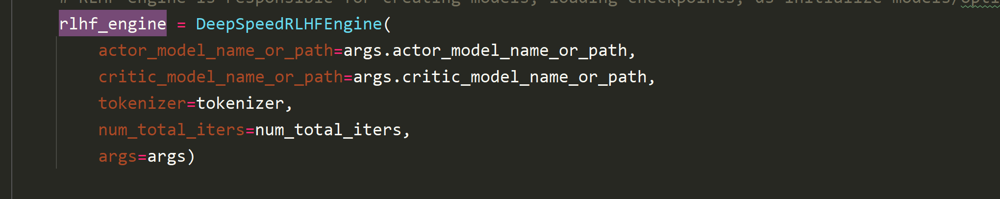

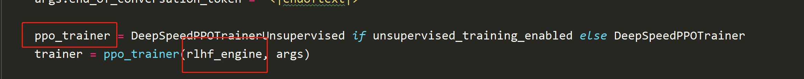

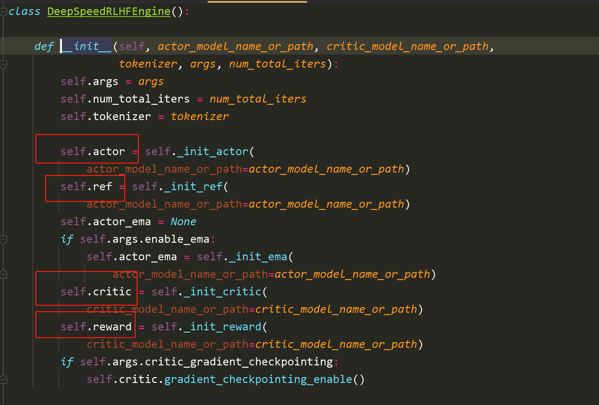

这里的actor和ref直接用hugging face的AutoModelForCausalLM初始化(就是decoder-only的LM)，然后critic和reward在LM末尾接了一个分类头用来预测分数，forward的时候将所有token的词向量输入到分类头里降维成1，对于reward来说取了answer的最后一个token作为最后的奖励分数。<font color='red'>这里有个小疑问，step2里训练reward模型的loss，似乎是把chosen和reject的token分数对齐，然后相减取平均，为什么这里只取了最后一个token的分数？</font>

**训练开始：**

注意是两层epochs循环嵌套。外层args.num_train_epochs，里层args.ppo_epochs。

第一步，先从prompt数据集里采集数个prompt输入到actor模型中，获取生成的序列seq(huggingface默认的生成配置是greedy search，也就是不采样直接argmax概率最大的token)。将seq输入到actor和ref中得到概率分布log_prob和ref_log_prob，输入到reward模型中得到奖励reward_score(大小是[bs\*1]，只有一个得分)，输入到critic中得到V值估计values(大小是[bs*seq_len]，每个token都有一个得分)。**下一步就是用这些生成的样本更新args.ppo_epochs个回合**.

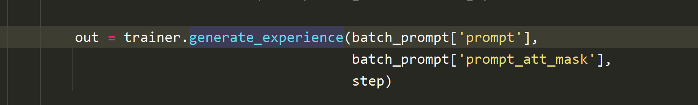

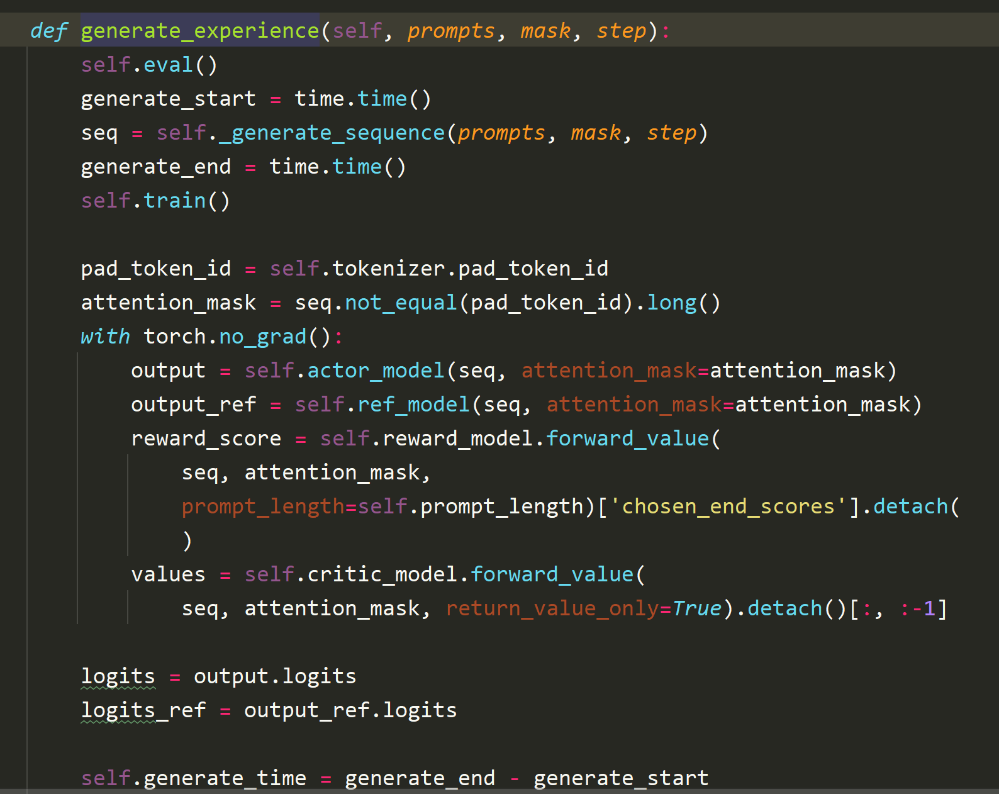

第二步，计算奖励和优势。

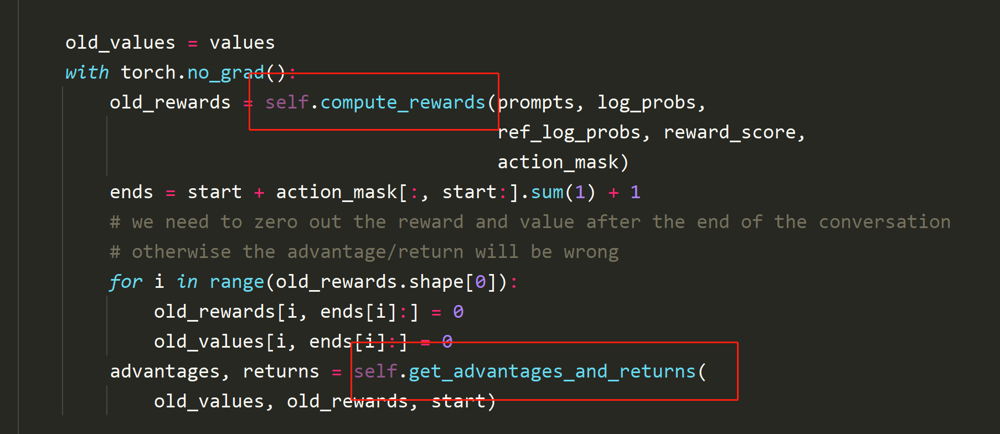

奖励计算：在compute_reward函数里，先对每个token算了下KL散度，防止actor模型的概率偏离ref模型太远，然后在最后一个token叠加了reward模型的打分reward_clip，这个clip只是很简单的限制了上下界$max(min(reward, 5), -5)$。

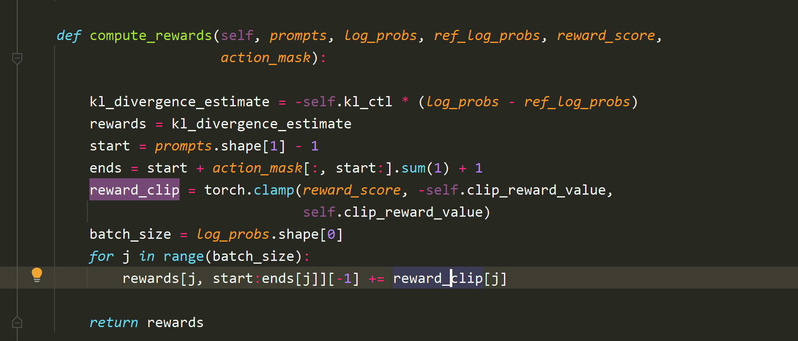

优势计算：在get_advantages_and_returns函数里，用了动态规划从后往前递归计算GAE。额外的返回值returns用于更新critic网络，含义是每个token位置的目标V值。<font color='red'>这里有些疑问，PPO论文里没写$V^{targ}_t$是啥</font>。returns的推导如下，可以理解成是Advantage计算完了，把$V_t$重新加上去就是目标的V值。
$$
\begin{align}
\hat{A}_t &= \delta_t + \gamma\lambda \hat{A}_{t+1} \\
\delta_t & = r_t + \gamma*V_{t+1} - V_t \\
returns[t] &= \hat{A}_t + V_t \\
		  &= \delta_t + \gamma\lambda \hat{A}_{t+1} + V_t \\
		  &= r_t + \gamma*V_{t+1} - V_t +\gamma\lambda \hat{A}_{t+1} + V_t \\
		  & = r_t + \gamma*(V_{t+1} +\lambda \hat{A}_{t+1})
\end{align}
$$
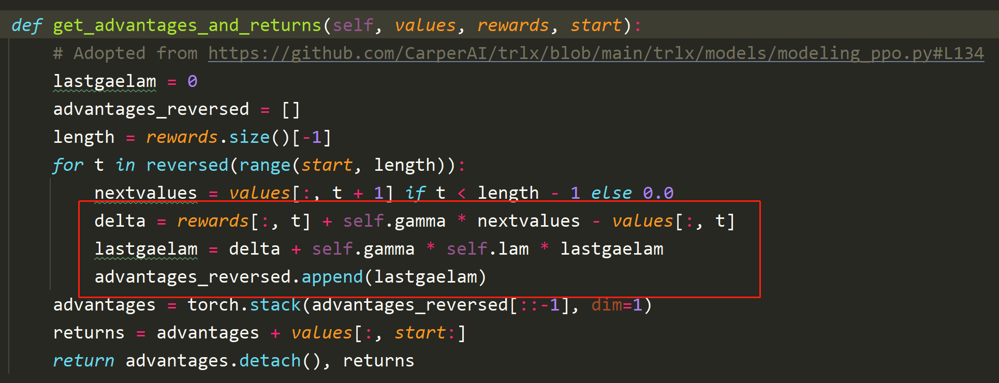

第三步，更新actor网络。这里需要注意，我们生成文本时用的actor_old和现在的actor参数不一样，因为每个train_step都会用actor_old生成文本，然后训练ppo_epochs步的actor网络。下面算了最新的actor的网络的文本概率，用于计算PPO里的重要性采样$\frac{\pi_{\theta}(a|s)}{\pi_{\theta_{old}}(a|s)}$。actor_loss_fn中的计算方法和PPO的原理部分中的“重要性采样+截断”对应。从函数里可以看出，最后是取了每个没有被mask的token的loss平均值作为最终的损失。

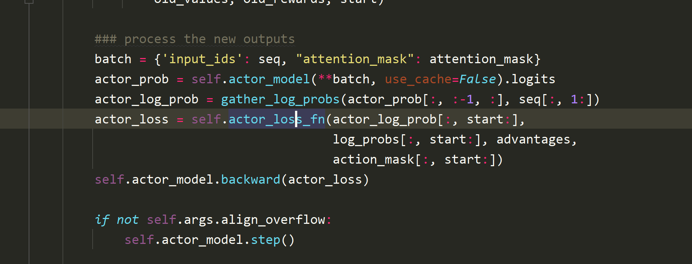

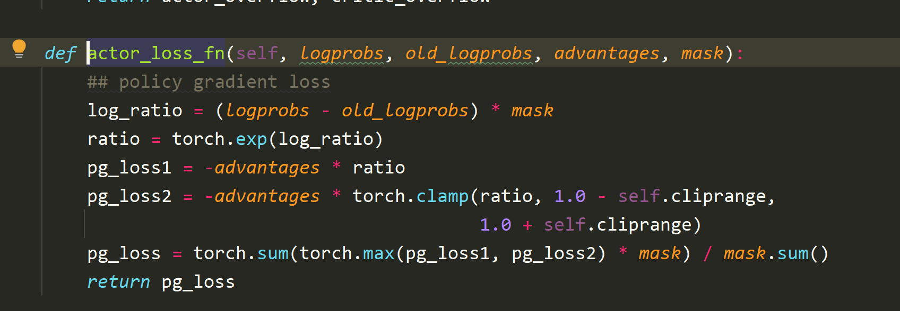

第四步，更新critic网络。这一步用到了优势计算时的returns。这一步比较简单，截断后用MSE拉近新的critic网络和returns。

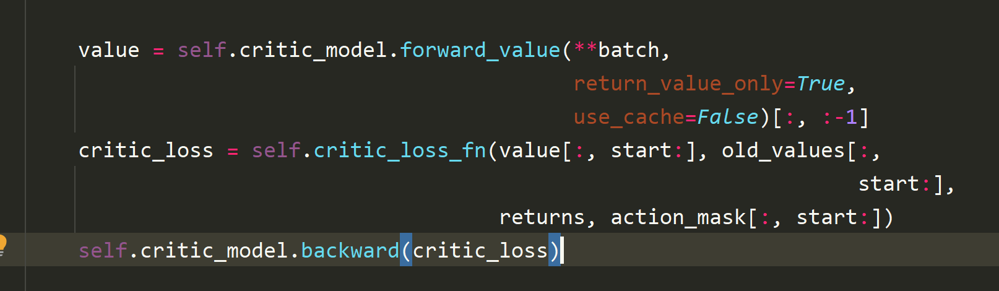

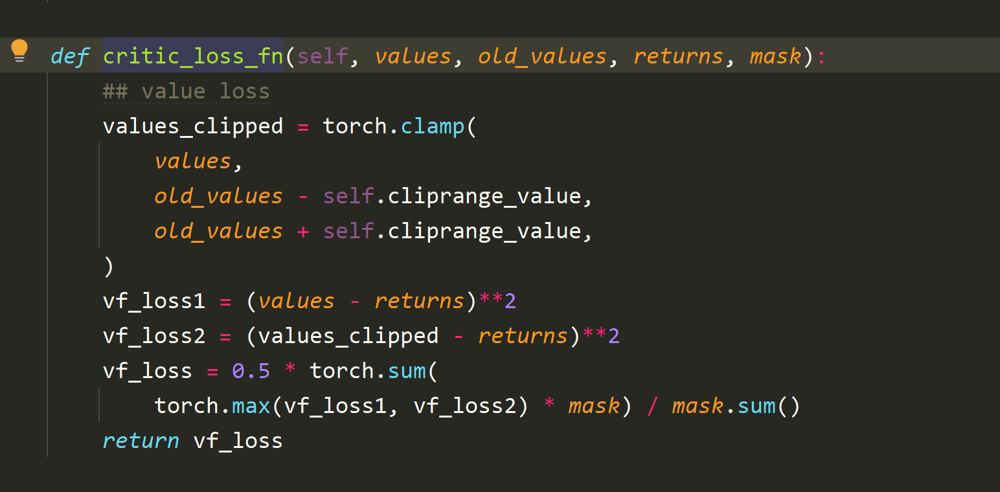

第五步，梯度反传更新两个模型actor和critic。


没卡没环境，只是读了下代码没用数据跑，可能有错误，敬请各位大佬指正。

### 参考资料

[深度强化学习 -- Actor-Critic 类算法（基础篇)](https://zhuanlan.zhihu.com/p/148489261)

[Proximal Policy Optimization Algorithms](https://arxiv.org/pdf/1707.06347.pdf)

[强化学习中值函数与优势函数的估计方法](https://zhuanlan.zhihu.com/p/345687962)

https://zhuanlan.zhihu.com/p/630205810

https://arxiv.org/pdf/2203.02155.pdf

https://www.cnblogs.com/jiangxinyang/p/17553815.html

https://zhuanlan.zhihu.com/p/635757674

https://mathmach.com/ff7e0546/

https://zhuanlan.zhihu.com/p/624589622

https://www.cnblogs.com/jiangxinyang/p/17374278.html

